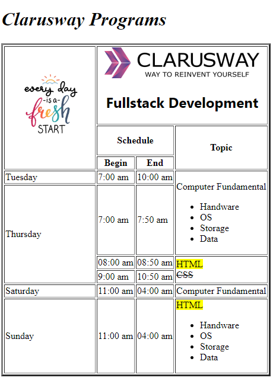

# Programs Table

<h3>visit: https://aokmen.github.io/programs-table
/</h3>

# Description:

The code creates an HTML table that contains information about Clarusway Programs.
The table has a header row with three cells, and two data rows with four cells each.
The first cell of the header row contains an image, and the second cell contains a logo and a heading.
The second row of the header contains three cells with column labels.
The first data row contains information about Tuesday's schedule and the computer fundamentals topic.
The second data row contains information about Thursday's schedule and the HTML and CSS topics.
The third data row contains information about Saturday's schedule and the computer fundamentals topic.
The fourth data row contains information about Sunday's schedule and the HTML topic, along with a list of subtopics.
